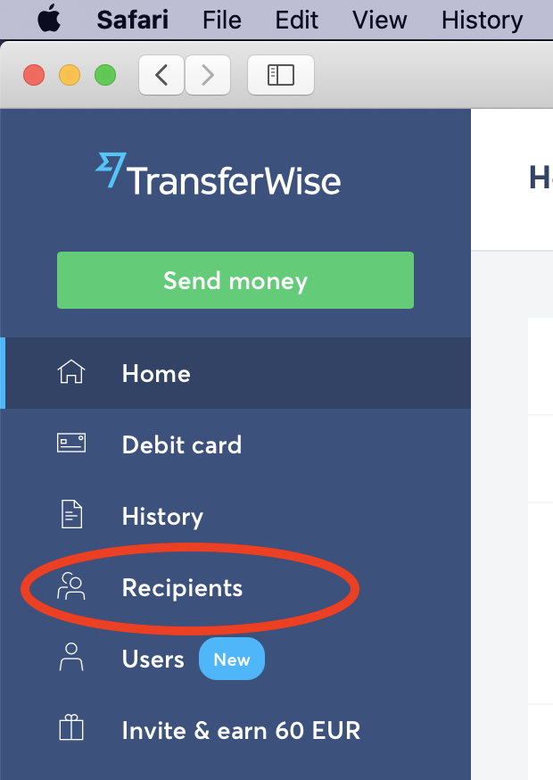
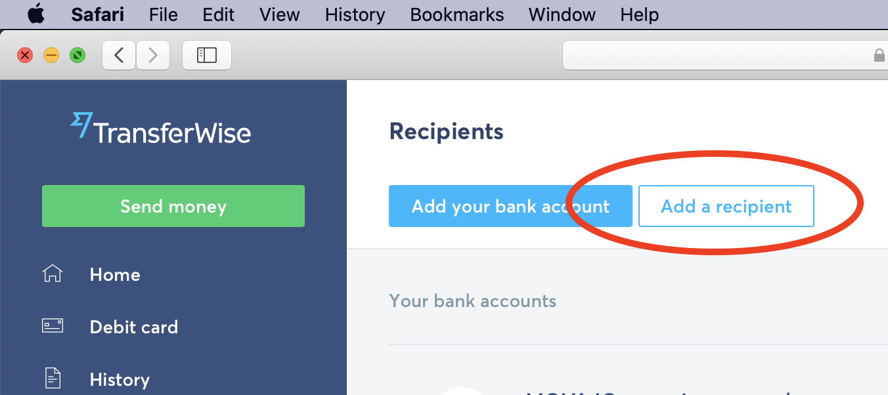
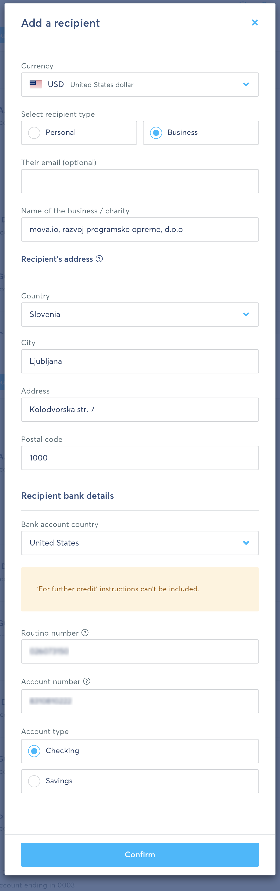
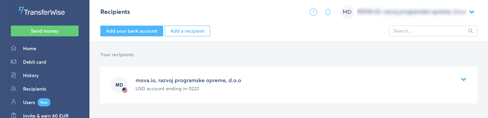
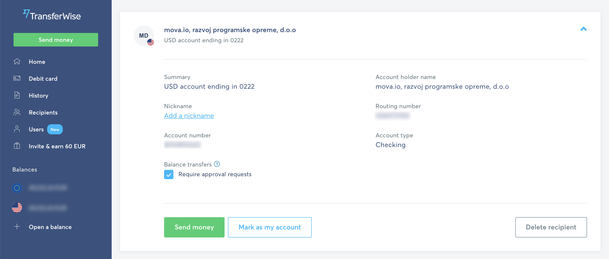
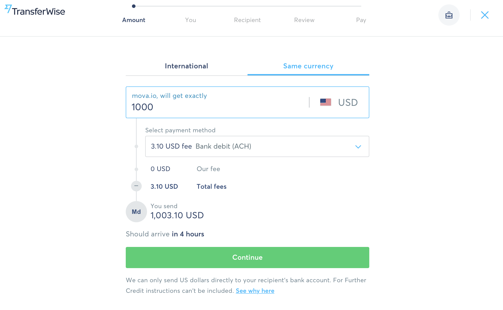
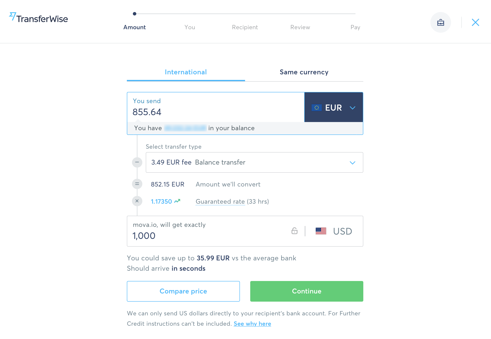
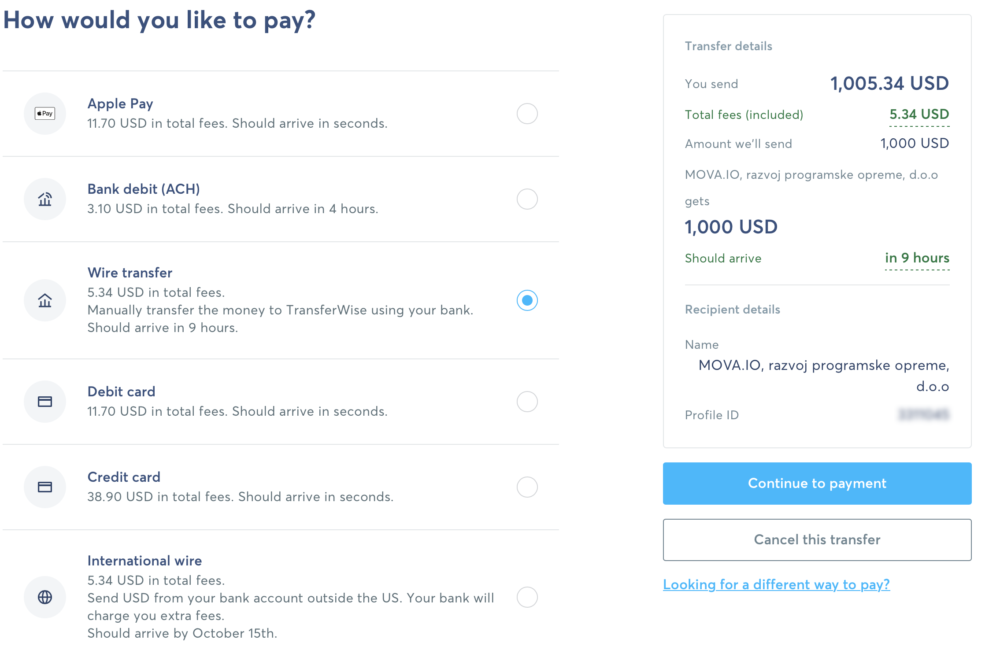
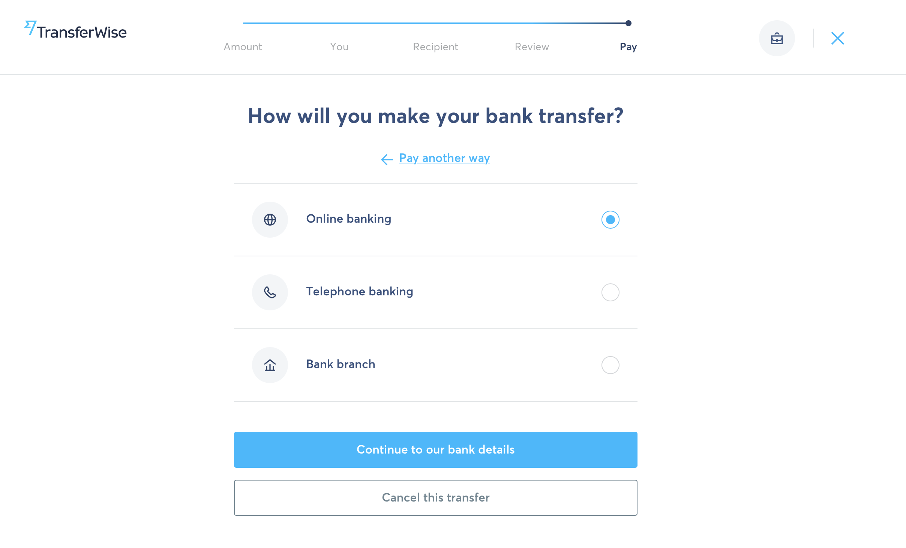

# Add a Recipient

When adding a _Recipient_, TrnasferWise saves our bank credentials, and in the future, you can just select `mova.io` from the list of recipients and set the amount from the invoice. This way will save some time on filling in all the bank credentials, addresses, and other details.

1. Create a TransferWise account, if you don't have it yet: [transferwise.com](https://transferwise.com/register)

2. In the side menu, click on `Recipients`

3. In the top, click on the `Add a Recipient` button:

4. Fill the presented form with the data from the invoice. **Please note:** on the screenshot below, some data is hidden for security reasons. You can find all the parameters needed in the invoice.

5. When all the data is filled, save the Recipient. You will now see the new Recipient on the Recipients page:

6. If you click on it, you will see all the details, and the button "Send Money":

7. Here the process differs slightly.

### If you are in the US, _or_ your account is in USD

You can select the **Same Currency**. This will show you the fees for the same currency transfer: USD to USD. Just fill the textfield `mova.io will get exactly` with the amount from the invoice, and press Continue.

### If you are outside of the US, or your account is in non-USD currency (e.g. EUR, GBP, etc)

You can select **International**, and choose the currency of your bank account (for example, EUR, GBP, AED, or any other). Now, fill the amount from the invoice into the `mova.io will get exactly` textfield. Make sure that this textfield is marked with US flag (US Dollars icon) - this is an important step because the transfer is made in different currencies.

Now, press Continue.

8. The following steps are simple: transferwise will ask you to ensure that all the data is correct, and will provide you different payment options: whether a credit card, transfer from your bank account, and so on:

9. You can select any option that works for you here. In case you choose a bank transfer option (sometimes it is labeled as `International wire transfer`, `Bank transfer`, `Wire Transfer`), you will be presented with a new set of choices:

Here you can just select an `Online Banking`. Transferwise will show you their bank credentials. Basically, you will need to send the money to those credentials displayed at this step, and TransferWise will redirect them to use.

Why do you need to send money to TransferWise, instead of sending the transfer to `mova.io` right away? This is just to save (a lot) on commissions. TransferWise has banks all over the world, and instead of making an expensive international transfer from US (or Australia, or UAE, or any other country) to Slovenia - we transfer money locally to TransferWise (they have bank account in your country), and they redirect them to us.

If some of the steps in the tutorial aren't clear, or some of the steps have changed - please reach out to us, and we will be happy to help!

