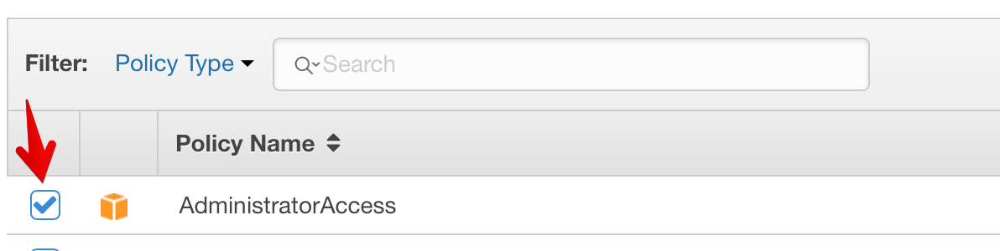
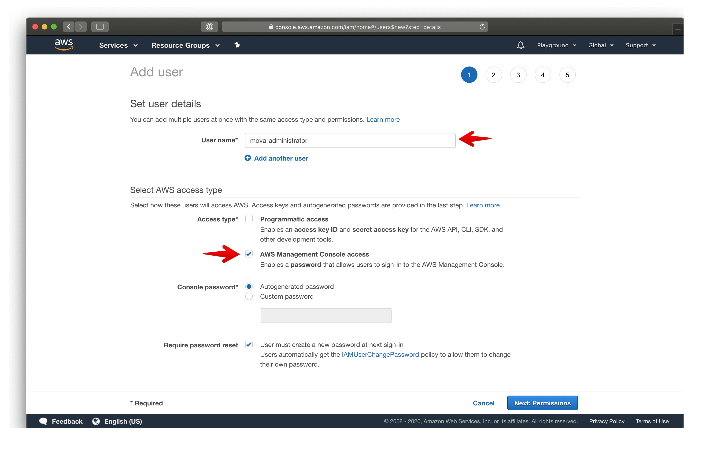
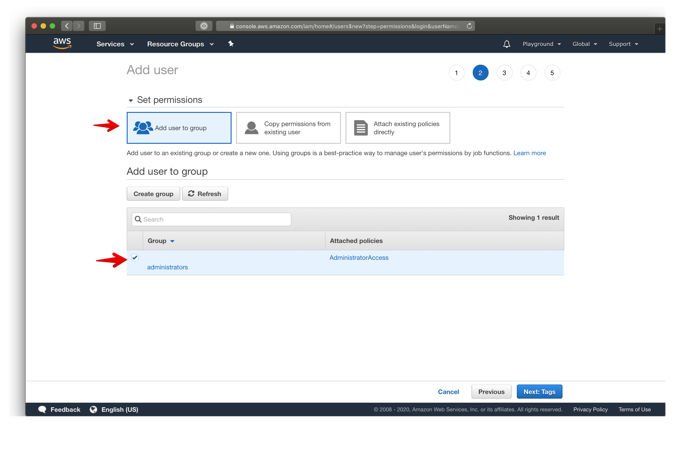
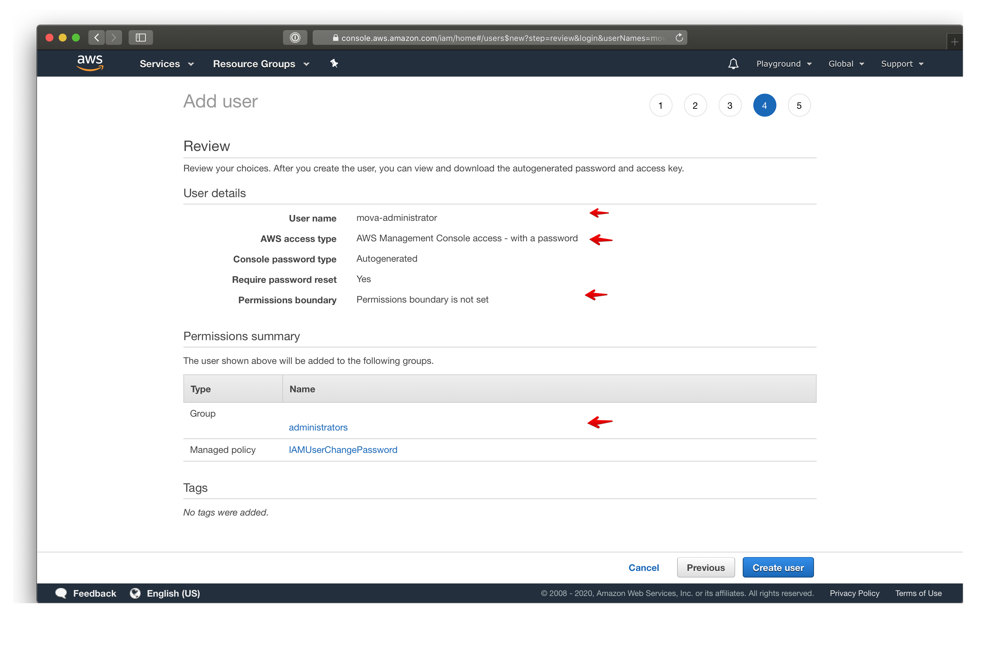
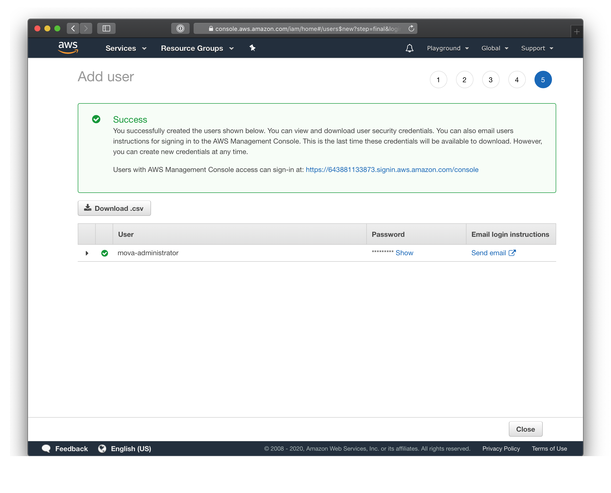

# Amazon AWS Developer Invitation Guide

## Create an account

We recommend you to create a new Amazon account (even if you have an account for another your project) for a new project to a new email address.

To do it, visit [https://aws.amazon.com/](https://aws.amazon.com/), click at the button "Create an AWS Account" (it might have a text "Complete Sign Up" if you tried a process before) and fullfil the registration form

## Create administrative user

1.  Visit "AWS Management Console" ([https://console.aws.amazon.com/](https://console.aws.amazon.com/)) and Sign In into your Root account

2. Visit "Identity and Access Management (IAM)" [https://console.aws.amazon.com/iam/home](https://console.aws.amazon.com/iam/home)

3. In the left panel, go to "Groups" section: [https://console.aws.amazon.com/iam/home#/groups](https://console.aws.amazon.com/iam/home#/groups)

4. Click "Create New Group" button
    
5. For input "Group Name" type `administrators`. Click "Next Step" (at bottom-right)
    
6. Select `AdministratorAccess`. Click "Next Step"  

7. Review that "Policies" have value `arn:aws:iam::aws:policy/AdministratorAccess`. Click "Create Group"

8. In the left panel go to "Users" section [https://console.aws.amazon.com/iam/home#/users](https://console.aws.amazon.com/iam/home#/users)

9. Click "Add User" button
    
10. Enter "User name" field (E.g. `mova-administrator`) and select "AWS Management Console access" checkbox (other fields are by default. Check the image belov). Click "Next: Permissions"
    
    

11. Select the group that you created early 

    
    
    You might see other groups (if that is not a new account) or empty list (if did not create a group)
  
12. Click "Next: Tags"

13. Click "Next: Review"

    
    
14. Click "Create user"

15. When user did create you will see the success message
    
    
    
16. Copy the next  essential info:

    - Sign in URL. Copy it, we will need it for login
    - Username (the one you set on step #5). Copy it as well
    - Password. Press the "Show" button, and copy it as well.

    Please send these 3 values to us, and we will be able to use it for login.

    PS: Clicking at the button "Download .csv" will raise download a file with credentials

