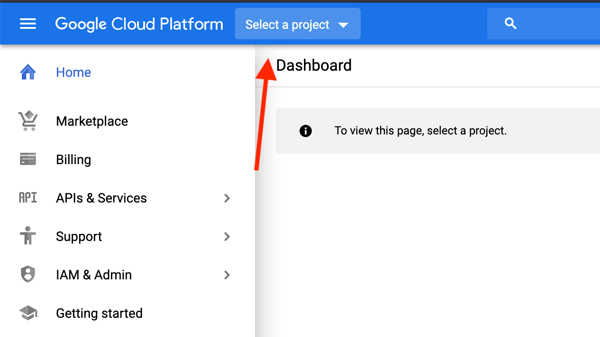
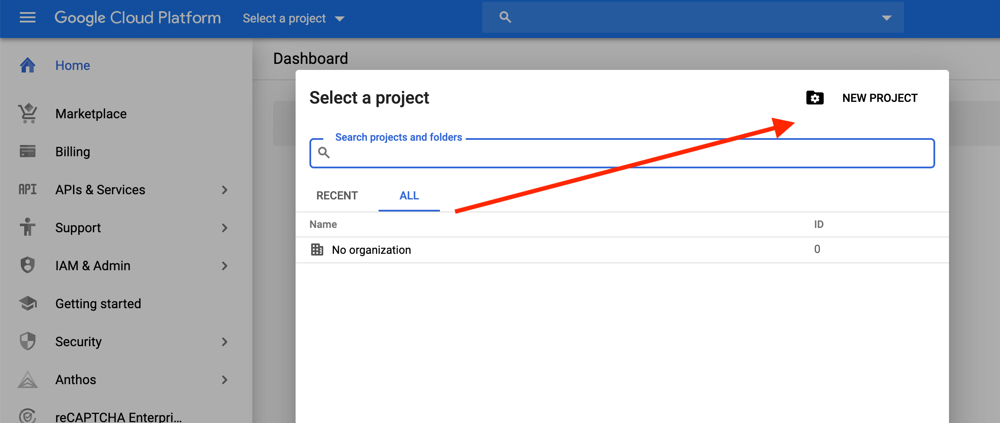
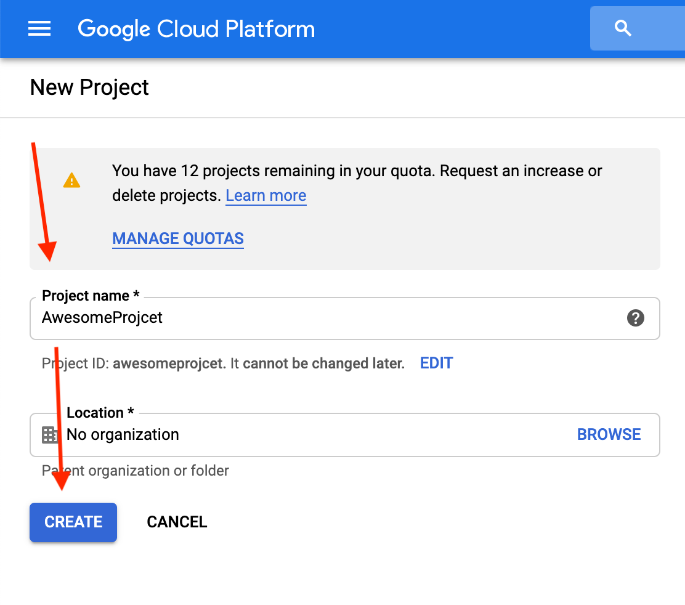
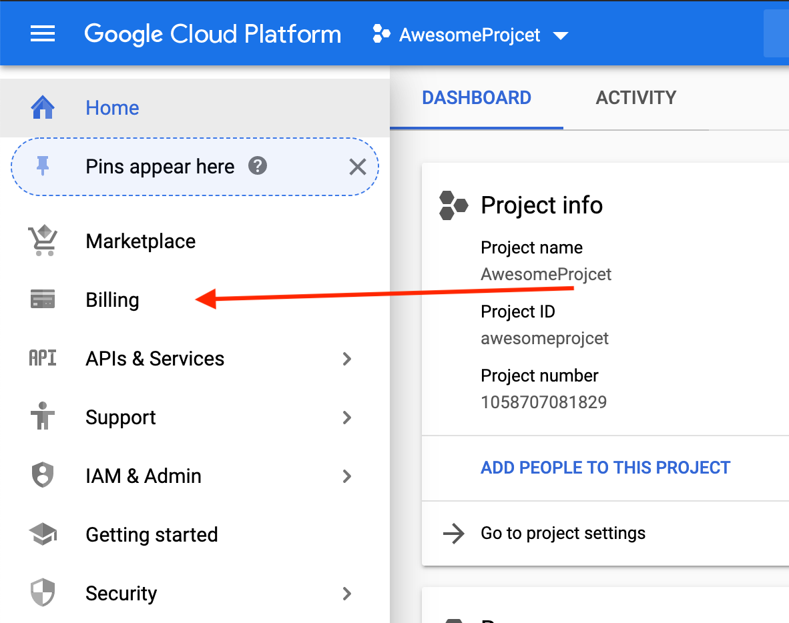
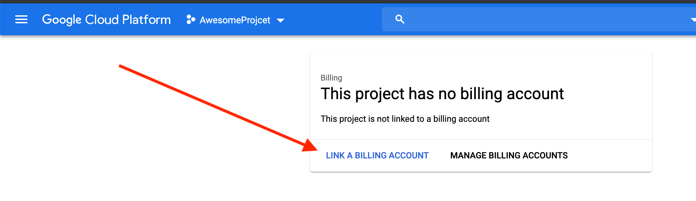
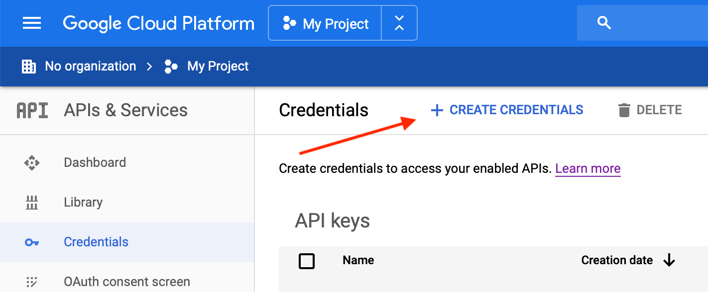
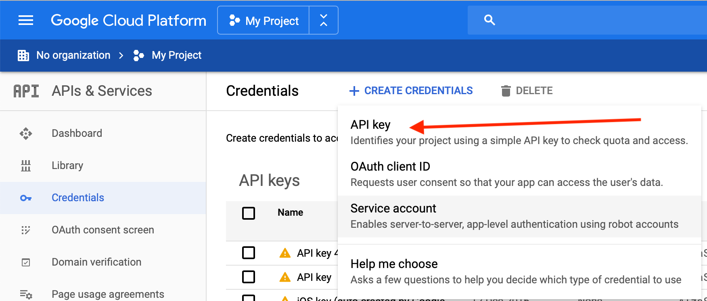
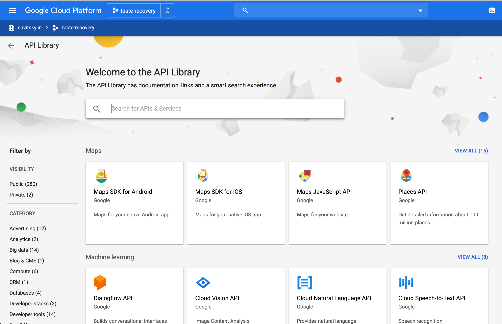
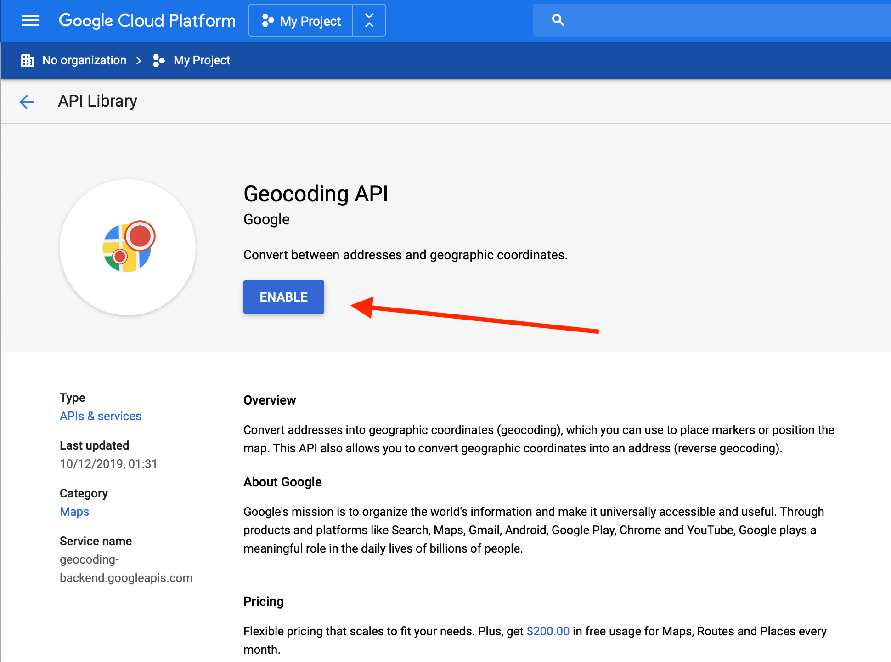
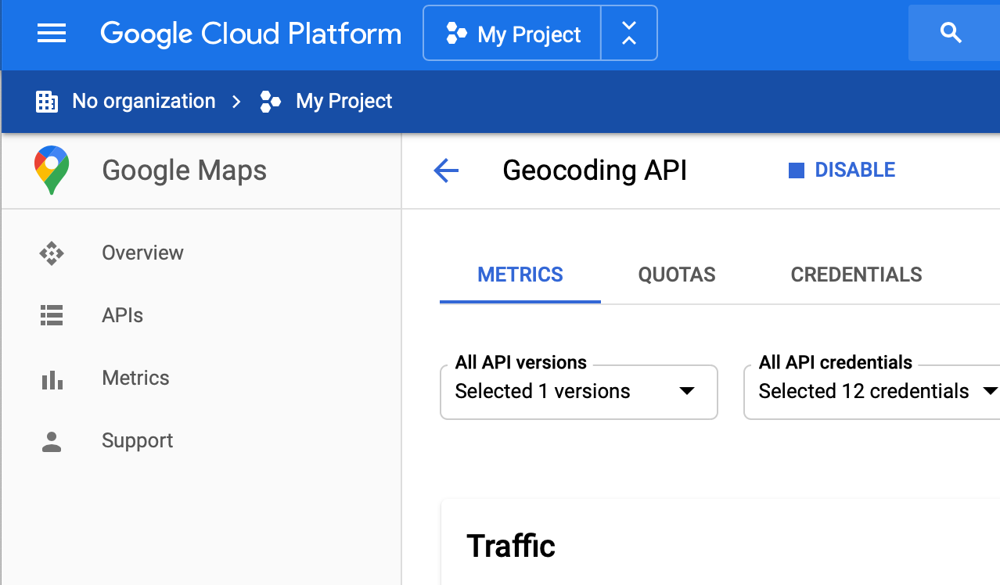

# Google API Key

1. Go to Google [Cloud Platform Homepage](https://console.cloud.google.com/home)

2. In the top bar, press "Select a Project".

3. In the new popup, press "New Project".

4. Fill the Project name, and save it.

5. Now we need to setup Billing, otherwise, Google won't allow us to use its services. On the home page, press the  Billing button. Then - Link a Billing Account

6. You will be asked to create a new Billing account. Just follow the instructions. Select the country, address, and enter the billing info.

7. When done, just open the [Cloud Platform Homepage](https://console.cloud.google.com/home) again

8. Now we need to create an API key, that will be used to access the services. To do it, press `APIs and Services`, and then go to `Credentials`.

9. Press `Create Credentials` in the top bar, and select `API Key`:

10. Select, copy and **Save** the new API Key. Please share it with us. After the development, we will also need to restrict the key, to improve security.

11. Now we need to enable APIs that we are going to use. To do it, go to `APIs and Services` section.

12. From there, go to the Library. Now you can enter the names of the services that we will need. Services that we need depend on the project. Please only select those, that we will need. Usually, it is:
- Maps SDK for JavaScript
- Maps SDK for Android
- Maps SDK for iOS
- Places API
- Geocoding API

13. Find the API that we will need (one by one). Select it, press "Enable", and repeat the steps for the new API (previous step, and the current one.). When enabling each API, you will be redirected to its dashboard.  Simply go to [Cloud Platform Homepage](https://console.cloud.google.com/home) to go back to the APIs Library, and enable the next API needed.

14. When done, please make sure to share the API Key with us.