# Google Play API Access & Merchant Account Setup (needed to verify In-App-Purchases)

**Approximate setup time:** 15-20 minutes.

Important note: This guide assumes that the steps below will be made BEFORE the in-app product has been created. If we already have In-App Products created (in any application) we have to create a new one (and delete it after these steps will be done). This is a known and a weird bug on Google's side.

1. Login to Google Play Publish Console with Owner Account (the very first account that was used to create a Google Play Developer account): https://play.google.com/apps/publish

2. In the left Side Menu, select "Order Management". In the main part of the screen, you will be asked to create a Merchant account. It is an easy process, where you will just need to provide more info about the company.

3. In the Side Menu, select "Settings" (2). If you are on a smaller screen, the side menu can be hidden. To show, click on a Hamburger icon (1)

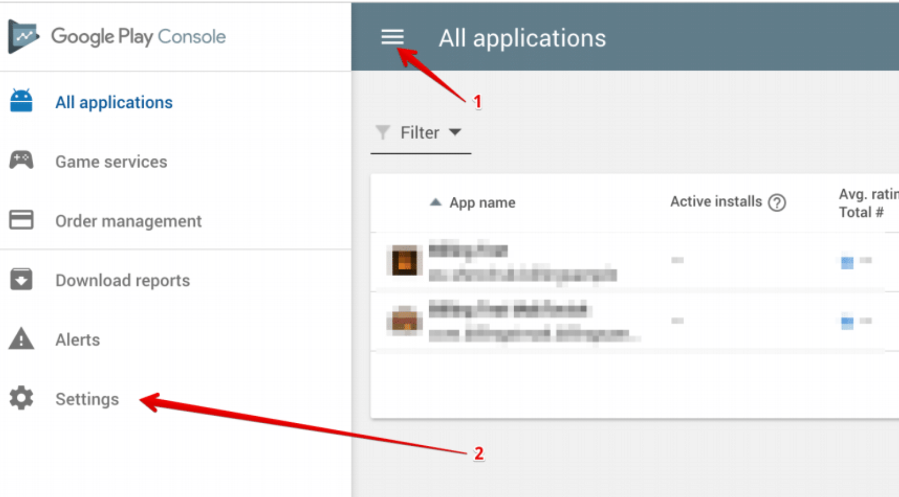

4. In the Side Menu, expand "Developer Account" (1), and go to "API access" section (2)

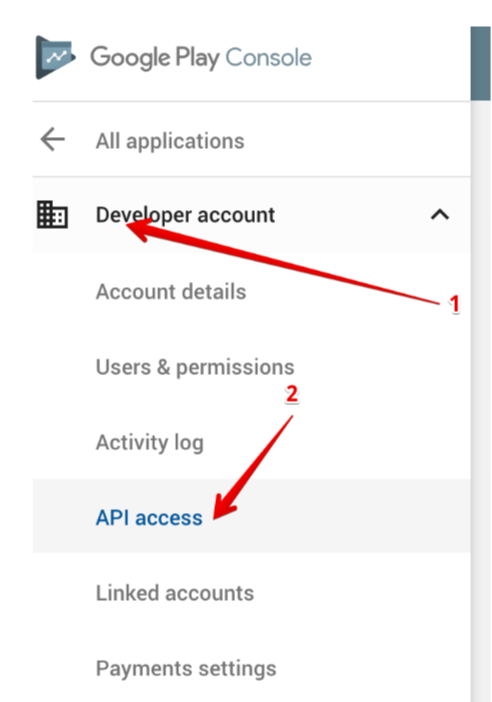

5. Click "Create new project" [1] (recommended) or Link [2] to existing Project (if it was created previously)

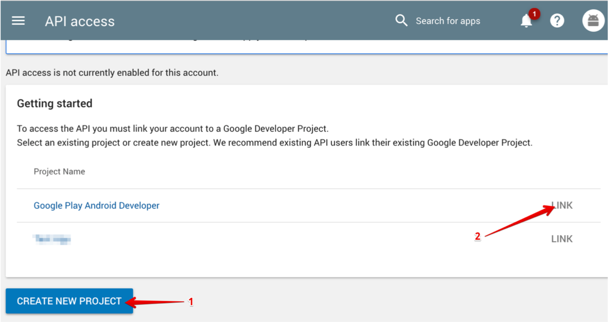

6. After that, the page should refresh. You will see a linked project "Google Play Android Developer" (in case you have chosen "Create new project" in the previous step):

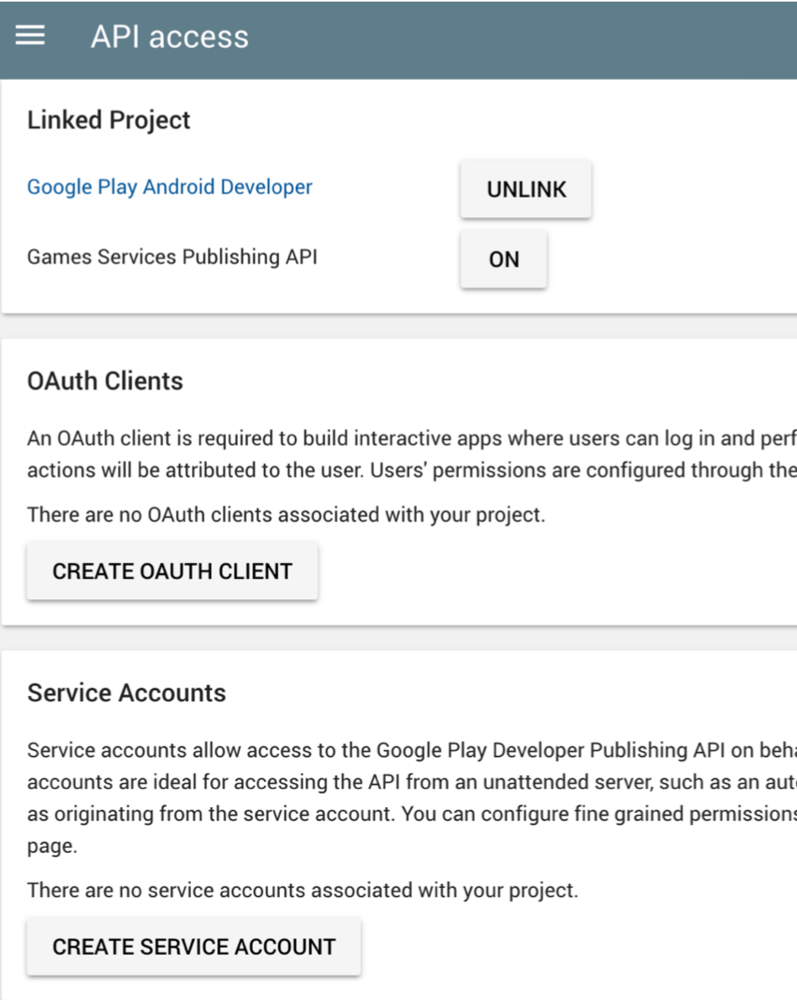

7. On the same page "API Access", click on a "Create Service Account" button under "Service Accounts" section. In the shown alert, select "Google API Console" (point #1), it will open a new tab in the browser.

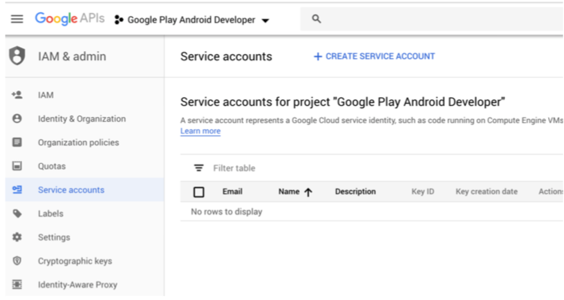

8. Click "Create service account" and fill the form: in "Service account name" [1] type "Google Play" (or any other name). It will automatically fill "Service account ID" [2] (note that Service account ID must be a string between 6 and 30 characters). Click "Create" [3]

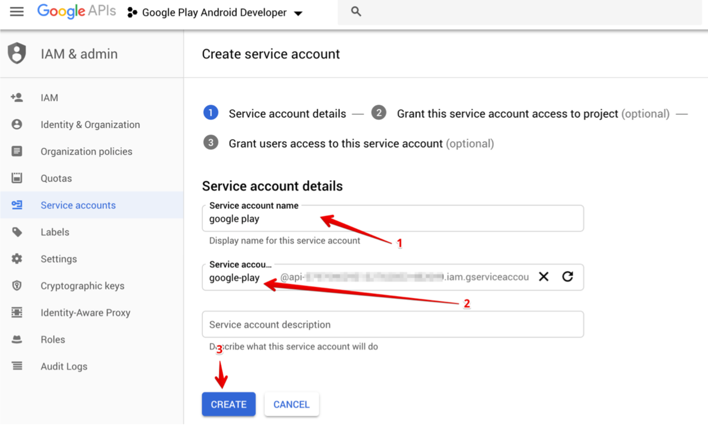

9. On a second step click "Select a role" and chose "Project" -> "Viewer". Click "Continue"

10. On the next step click "Create key" [1]. In right-side panel select JSON [2] and click Create [3]. It will download a new JSON file, which needs to be added to our backend server. **Please save the file**, and share it with us. When the file is downloaded, click "Close" in the presented dialog (appeared after the private key was generated) and click the "Done" [4] button.

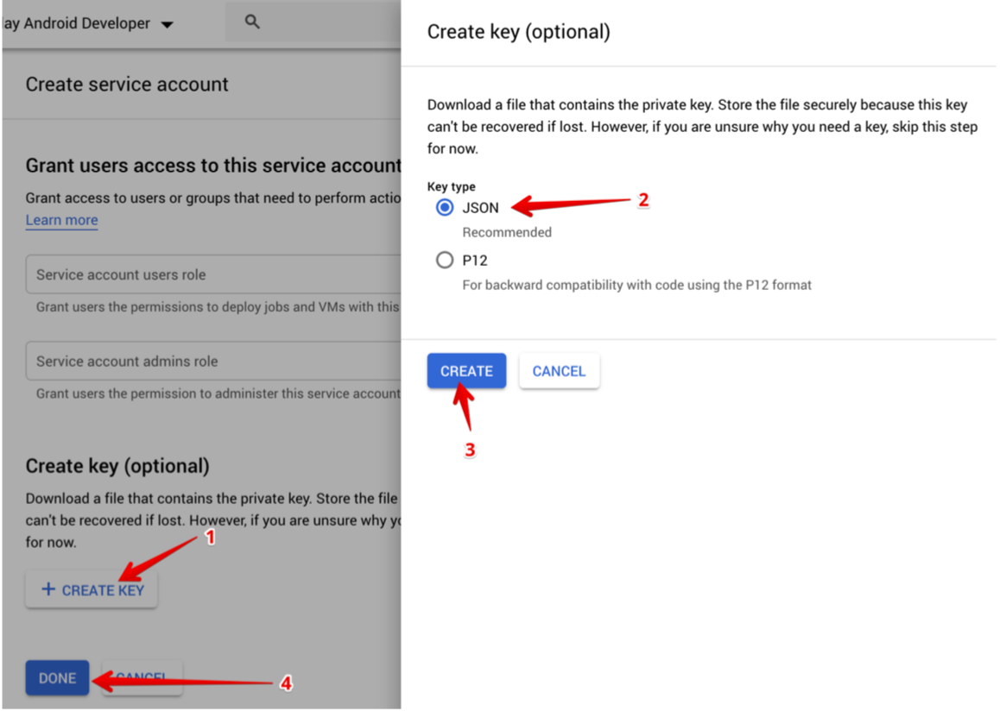

11. On the page, header click on the search input field and type "Google Play Android Developer API" [1]. It should suggest one result [2]. Click at the suggestion [2]:

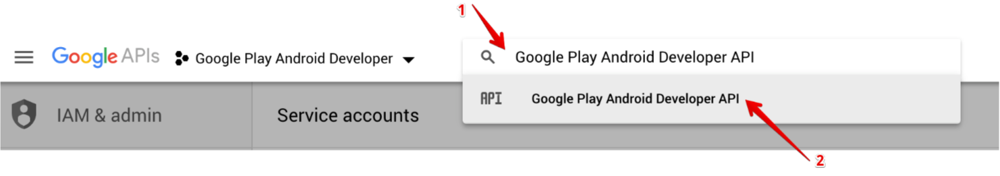

12. If you have created a Google Project from Google Play console (step 4 in this guide) that API will be enabled by default, nothing needs to be changed. If not (the project was created previously, and linked in step 4) you need to enable that API. When done, you should see a screen like that (with the text "Disable API", which means it has been enabled):

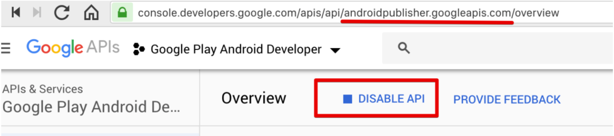

13. Switch back to the Google Play Console and click "Done". It will refresh the page and you should see a similar result. Click "Grant Access" [1] - it will navigate to a new page.

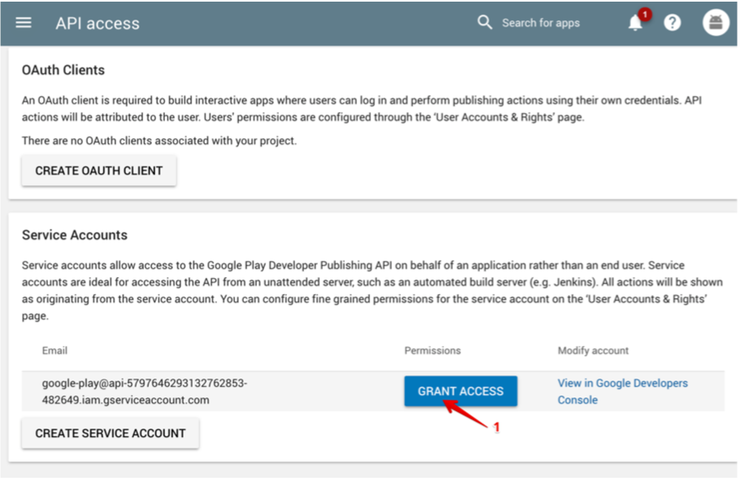

14. In new modal dialog switch Role to "Finance" [1] (by default in shown "Release manager"). "Add an app" [2] where we need to develop In-App Purchases (optionally, this can be skipped, and access to all apps will be given).

**It is important** to make sure the checkbox under "View financial data" [3] is turned on. Then, click "Add user" [4]:

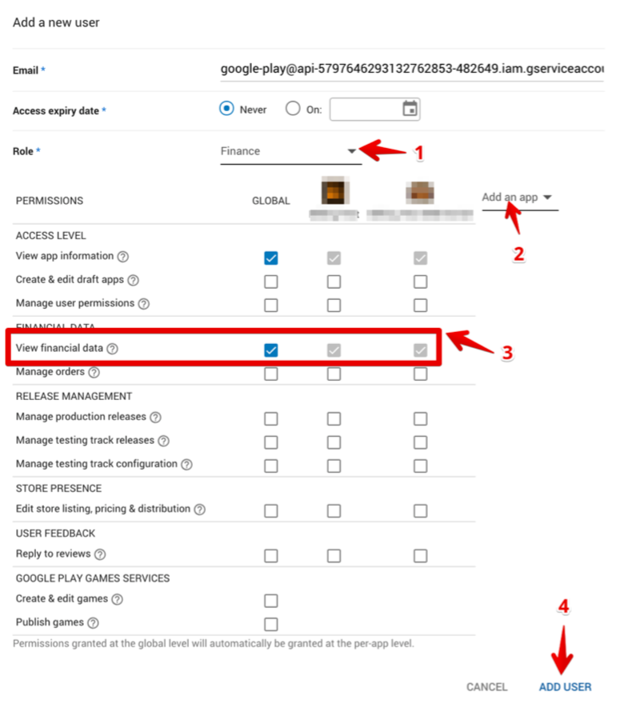

15. Finally, you should see that Service account on the Users & permissions page:

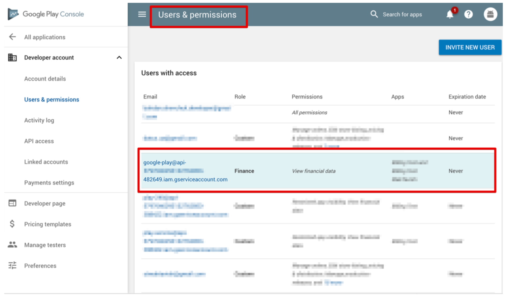

At this stage, Google's In-App Purchases should be activated. Please share with us a downloaded file, we will need to add it to the back-end to verify purchases.