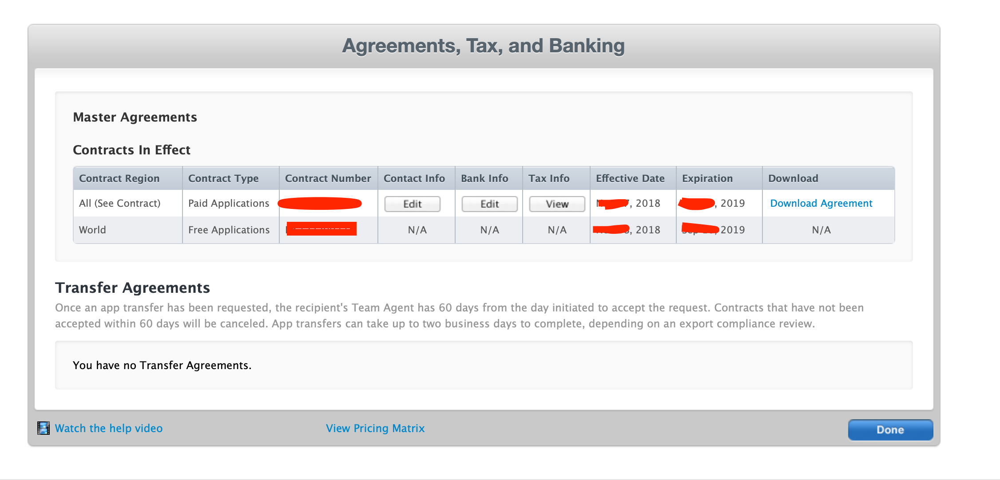

# List of Services

## Mobile Development (developer accounts, API access)

#### 1. Apple Developer Account

Used to create certificates and provisioning profiles. Usually, it is better to have it from the beginning, but we can start without it too. However, it will be extremely important when we will need to upload builds to the TestFlight.

Signup: https://developer.apple.com

Pricing: https://developer.apple.com/support/purchase-activation/

#### 2. App Store Connect Account

Used to create App Store Listing, and to upload builds to TestFlight.

Important: if we will work with In-App Purchases, the `Banking & Taxes` section has to be completely filled. Otherwise, Apple won't allow us to start working on In-App Purchases.

Signup: http://appstoreconnect.apple.com

**Note:** App Store Connect Account will be created for you at the same time when you create Apple Developer Account. No further actions needed.

Pricing: $0 (part of Apple Developer Program)

#### 3. App Store Connect: In App Purchases

If the application uses In-App Purchases, all the info in "Agreements, Tax, and Banking" has to be filled in. Under "Master Agreements" we should see "Contracts in Effect" section with at least 2 contracts:

Besides, to start working with In-App Purchases, we need an In-App Purchase product created (iTunes Connect → My Apps → "Your App Name" → Features → In-App Purchases).

We will need:

- Product ID
- Product Type
- App-Specific Shared Secret (if the auto-renewable subscription will be used)

Pricing: $0 (part of Apple Developer Program)

#### 4. Google Play Account

Not very important when starting working on Android. However, it is important to have it if the application will have In-App Purchases.

For In-App Purchases we need an invitation with Administrator access and mandatory setup of Google Merchant Account and API Access (unfortunately those can be done *only* by account owner).

**NOTE:** Ownership of Google Play Account can't be transferred to another account. We can only transfer applications from one to another Google Play Account.

It's recommended to create a new Google (Gmail) account per Project (if you already have Google Play Account with other apps) to avoid the issue when Google might block (ban) an account because of one app (in case if you have multiple applications).

Signup: https://play.google.com/apps/publish/signup/ (requires Google Account)

Pricing: $25 fee

#### 5. Google Play Merchant Account

Must be configured only if the application has In-App-Purchases (or app is Paid). Without this IAP Products and/or Subscriptions can't be created.

More info: https://support.google.com/paymentscenter/answer/7161426?hl=en

#### 6. Google Play API Access (needed to verify In-App-Purchases)

API access is needed for all apps that have In-App Purchases (Merchant Account *must* be configured too).

Setup Guide: [Google Play API & Merchant Account Setup](google_merchant.md)

#### 7. Google Cloud Platform Account

For projects that will use Google API services like Maps (showing dynamic/static map views in the app), Places (locations suggestions), Geocoding, etc, we must set up API Credentials and configure security restrictions. That requires an invitation with the Editor role. The billing account also must be configured.

Signup: https://console.cloud.google.com/project (requires Google Account)

Pricing: Depends on APIs used (e.g. Maps, Places, etc)

Setup Guide: [Google API Key Setup Guide](google_api_key.md)

## Web Development (hosting, databases, etc)

#### 8. Amazon Web Services (AWS) Account

Services that we will need access to:
- IAM (for access management, to make sure that S3/RDS and other services are set up securely. "AdministratorAccess" permission is preferable for reduce calls about missing permissions to other required services);
- S3 (hosting for files).

Additionally (for full AWS based project):
- EC2 (server instances);
- Beanstalk (deployment management for EC2);
- RDS (SQL database);
- Route53 (friendly DNS-management; at the beginning we can start with our domains but Production domain will be needed for the app release);
- Certificate Manager (for issuing free Amazon certificate to domains);
- Elasticache (some tasks, like background processing and real-time, requires Redis database);
- CloudWatch.

Signup: https://portal.aws.amazon.com/billing/signup

Pricing: Depends on services used (e.g. S3, RDS, EC2)

Setup Guide: [Amazon AWS Developer Invitation Guide](amazon_aws.md)

#### 9. Heroku

Alternative to Amazon AWS. Good for idea prototyping (MVP).

Pros:

1. One Heroku Account can be used to connect to many 3rd party addons (e.g. SendGrid, MongoDB);
2. Billing for those 3rd party services through Heroku.
3. Most addons have free tiers https://www.heroku.com/free (but at least $7/month needed for runtime).

Cons:

1. Not as flexible as AWS (e.g. we still needs AWS S3 for files storage);
2. Available only in US East and EU West for non-enterprise accounts.

Signup: https://signup.heroku.com/

Pricing: https://www.heroku.com/pricing

#### 10. Firebase Blaze (2x)

Alternative to Amazon AWS for simpler projects.

To work with the server, we will need access to the Firebase account. It is important to have 2 instances: one for production, one for staging.

Another important detail is to upgrade it to the Blaze plan - it is a paid plan, and will not have limitations. During development, costs won't be higher than $5 - $10 per month.

Signup: https://console.firebase.google.com/ (requires Google Account)

## Additional

#### 11. Domain names

Every application will need a domain name registered (e.g.: www.google.com). The domain itself is cheap (starting from $10 annually).

After the registration we will need access to the admin panel, so we can connect it to the server.

#### 12. SendGrid Account

Used to send emails (registration verification, notifications, and more). It is recommended if you plan to send marketing emails (e.g. blog posts, offers, etc).

**NOTE:** for essential production usage you should have a paid plan - $15+/month (otherwise it is limited to 100 emails/day).

Signup: https://signup.sendgrid.com

#### 13. Twilio

For a project that plans interaction with end-user through SMS/Voice:

- Programmable SMS (for sending any SMS messages, e.g. account alerts; order status, etc), Verify or Authy (phone number verification, 2FA, passwordless);
- Programmable Video (video chats between users).

**Note:** Twilio might be expensive for sending SMS to some countries. For apps that want to use phone validation only at user registration, we can use Firebase Auth Phone (which is free up to 10K verifications/month but has limited usage).

Signup: https://www.twilio.com/try-twilio

## Blacklist

- https://www.namesilo.com/ - service does not allow us to set custom DNS for subdomain records. Without it, we will have issues connecting subdomains to the Amazon AWS and other services;
