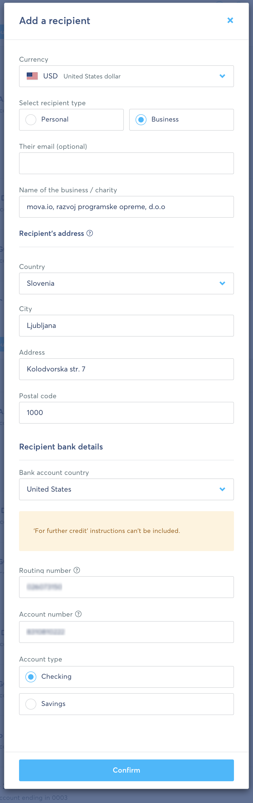
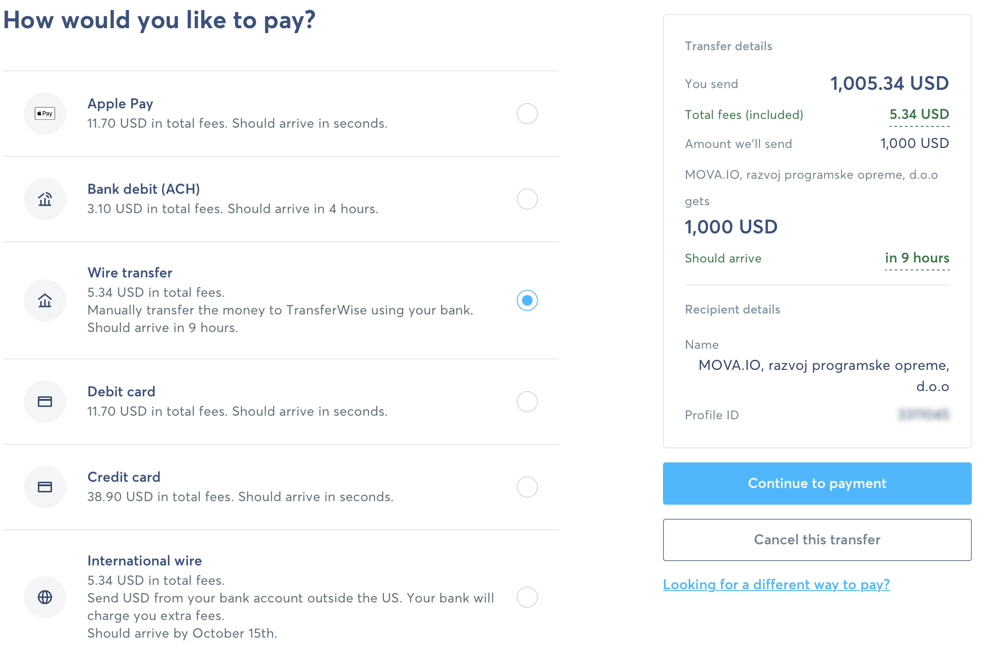

# Single Payment

Sending a single payment is a good option when you need to send just one payment fast. However, if you expect there will be multiple payments in the future, it might be a better idea to create a Recipient first, to save all the data, and re-use it later.

If you are looking for the instructions on how to create a Recipient in TransferWise, and to use it for sending payments, you can check our other guide here: [Create a Recipient](add_recipient.md).

To send a single payment, you can do next:

1. Create a TransferWise account, if you don't have it yet: [transferwise.com](https://transferwise.com/register)

2. In the side menu, click on `Send Money`, and then `Single Payment`

3. Here the process differs slightly.

### If you are in the US, _or_ your account is in USD

You can select the **Same Currency**. This will show you the fees for the same currency transfer: USD to USD. Just fill the textfield `Recipient will get exactly` with the amount from the invoice, and press Continue.

### If you are outside of the US, or your account is in non-USD currency (e.g. EUR, GBP, etc)

You can select **International**, and choose the currency of your bank account (for example, EUR, GBP, AED, or any other). Now, fill the amount from the invoice into the `Recipient will get exactly` textfield. Make sure that this textfield is marked with US flag (US Dollars icon) - this is an important step because the transfer is made in different currencies.

Now, press Continue.

4. Now you need to fill the data about the recipient. On the page `Who are you sending money to?`, you can scroll down, and select `Business or Charity`:

Scroll down and select `Business or Charity`:

5. Fill the presented form with the data from the invoice. **Please note:** on the screenshot below, some data is hidden for security reasons. You can find all the parameters needed in the invoice.

6. Next step is simple: we just need to review the payment details, and ensure that everything is fine. You can also set the _Reference_ field: usually it is set to the invoice number (e.g. MV-012020-01)

7. This is a final step - we need to select a payment option - how you will transfer the money. You can select any option that works for you here.

Most of the payment options are simple and straightforward. For example, if you select "Credit Card", you will be asked to enter your card details, and TransferWise will transfer the money.

8. In case you choose a bank transfer option (sometimes it is labeled as `International wire transfer`, `Bank transfer`, `Wire Transfer`), you will be presented with a new set of choices:

Here you can just select an `Online Banking`. Transferwise will show you their bank credentials. Basically, you will need to send the money to those credentials displayed at this step, and TransferWise will redirect them to use.

Why do you need to send money to TransferWise, instead of sending the transfer to `mova.io` right away? This is just to save (a lot) on commissions. TransferWise has banks all over the world, and instead of making an expensive international transfer from US (or Australia, or UAE, or any other country) to Slovenia - we transfer money locally to TransferWise (they have bank account in your country), and they redirect them to us.

If some of the steps in the tutorial aren't clear, or some of the steps have changed - please reach out to us, and we will be happy to help!

